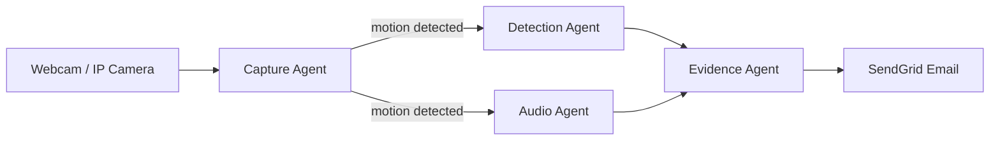

# Dumping Watch

Illegal dumping detector for public spaces. Camera watches an alley, AI analyzes every frame, and fires an evidence email the moment someone dumps trash. Built for India - reads MH/KA/DL plates, understands Hindi/Marathi audio.

## Pipeline



## Agents

| Agent | Model | Job |
|---|---|---|
| Capture | Python only | Pixel-diff motion check. Skips ~90% of empty frames at zero API cost. |
| Detection | GPT-4o Vision | Draws bounding boxes, reads license plates, crops face and vehicle. |
| Audio | Whisper | Classifies engine sounds, bag drops, voices in any Indian language. |
| Evidence | GPT-4o | Saves face/vehicle crops + JSON. Fires HTML email via SendGrid. |

## Stack

| Layer | Tech |
|---|---|
| Backend | FastAPI + Uvicorn |
| Orchestration | OpenAI Agents SDK |
| Vision | GPT-4o (high detail mode) |
| Audio | Whisper API |
| Alerts | SendGrid |
| Frontend | WebRTC + Canvas (no framework) |

## Setup

```bash
pip install -r requirements.txt
cp .env.example .env   # fill in your keys
uvicorn app:app --reload
```

Open `localhost:8000` and grant camera access.

## Keys needed

`OPENAI_API_KEY` / `SENDGRID_API_KEY` / `RECIPIENT_EMAIL` / `FROM_EMAIL` / `LOCATION_LABEL`

## UI

Live feed with real-time bounding boxes (red for people, amber for vehicles), face crop display, plate readout, and a scrolling incident log. Each confirmed dump saves 4 files: full snapshot, face crop, vehicle crop, JSON metadata.

No facial recognition database, no Aadhaar lookup. Pure CCTV-grade evidence package for police handoff.
